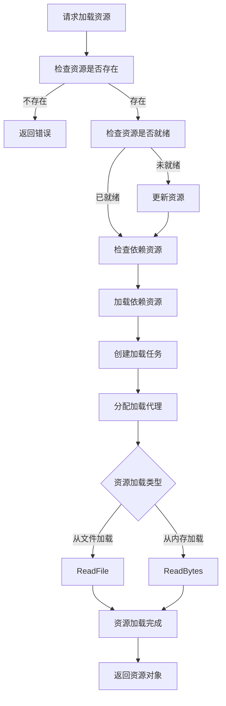

# 资源加载流程详解

## 资源加载整体流程

资源加载是GameFramework资源管理系统的核心功能，提供了高效、灵活的资源加载机制。整体流程如下：



## 资源加载详细步骤

### 1. 资源请求与检查

当客户端请求加载资源时，资源管理器首先会进行一系列检查：

1. **资源存在性检查**：
   - 通过`HasAsset`方法检查请求的资源是否存在
   - 如果资源不存在，返回错误信息
   - 如果资源存在，获取资源信息（AssetInfo）

2. **资源就绪检查**：
   - 检查资源是否已准备就绪（Ready状态）
   - 如果资源未就绪且处于可更新模式，触发资源更新
   - 如果资源已就绪，继续后续加载流程

3. **资源类型检查**：
   - 检查资源类型是否匹配请求的类型
   - 检查是否为二进制资源或普通资源
   - 根据资源类型选择不同的加载路径

### 2. 依赖资源处理

在加载主资源前，需要先处理其依赖资源：

1. **依赖分析**：
   - 从AssetInfo中获取依赖资源列表
   - 构建依赖树，确保加载顺序正确

2. **依赖加载**：
   - 递归加载所有依赖资源
   - 使用LoadDependencyAsset方法加载每个依赖
   - 维护依赖计数器，跟踪加载进度

3. **依赖回调**：
   - 当依赖资源加载完成时，触发OnLoadDependencyAsset回调
   - 通知客户端依赖加载进度

### 3. 资源加载任务创建与分配

资源和依赖检查完成后，创建并分配加载任务：

1. **任务创建**：
   - 创建LoadAssetTask或LoadSceneTask对象
   - 设置任务优先级、资源信息和回调函数

2. **任务池管理**：
   - 将任务添加到任务池中
   - 根据优先级排序等待执行

3. **加载代理分配**：
   - 从代理池中获取空闲的LoadResourceAgent
   - 如果没有空闲代理，任务继续等待
   - 分配代理后开始执行加载任务

### 4. 资源实际加载

根据资源的加载类型，执行不同的加载操作：

1. **从文件加载（LoadFromFile）**：
   - 适用于较大的资源，直接从文件读取
   - 如果使用文件系统，通过IFileSystem接口读取
   - 否则直接从文件路径读取

2. **从内存加载（LoadFromMemory）**：
   - 适用于较小的资源，加载到内存后处理
   - 读取资源字节数据到内存
   - 可能涉及解压缩和解密操作

3. **资源解析与实例化**：
   - 对加载的原始数据进行解析
   - 创建Unity资源对象（如Texture、Prefab等）
   - 处理场景资源的特殊加载逻辑

### 5. 资源对象管理

加载完成后，对资源对象进行管理：

1. **对象池化**：
   - 将加载的资源对象放入对象池
   - 设置资源的引用计数和生命周期

2. **资源缓存**：
   - 根据配置决定是否缓存资源
   - 设置资源的过期时间和优先级

3. **自动释放机制**：
   - 定期检查资源使用情况
   - 根据策略自动释放不再使用的资源

### 6. 加载完成回调

资源加载完成后，触发相应的回调函数：

1. **成功回调**：
   - 调用LoadAssetSuccessCallback
   - 返回加载的资源对象和加载时间

2. **失败回调**：
   - 调用LoadAssetFailureCallback
   - 返回错误信息和失败原因

3. **进度回调**：
   - 调用LoadAssetUpdateCallback
   - 返回当前加载进度

## 资源加载模式比较

GameFramework支持三种资源模式，它们在加载流程上有所不同：

| 特性 | 单机模式 | 可更新模式 | 边玩边更新模式 |
|------|---------|-----------|--------------|
| 资源位置 | 只读区 | 只读区+读写区 | 只读区+读写区+远程服务器 |
| 加载前检查 | 简单检查 | 版本检查+资源检查 | 实时检查 |
| 资源更新 | 不支持 | 启动时更新 | 按需更新 |
| 依赖处理 | 本地依赖 | 本地+更新依赖 | 本地+更新+远程依赖 |
| 适用场景 | 小型游戏 | 中型游戏 | 大型在线游戏 |

## 资源加载性能优化

GameFramework在资源加载方面采用了多种优化策略：

1. **异步加载**：
   - 使用异步加载避免阻塞主线程
   - 通过回调机制通知加载结果

2. **加载优先级**：
   - 支持设置资源加载优先级
   - 优先加载重要资源

3. **资源预加载**：
   - 支持资源预加载机制
   - 提前加载可能使用的资源

4. **资源复用**：
   - 通过对象池复用资源对象
   - 减少重复加载和实例化开销

5. **加载代理池**：
   - 维护多个加载代理
   - 实现并行加载多个资源

6. **文件系统优化**：
   - 使用自定义文件系统提高读取效率
   - 优化资源文件的组织结构

7. **内存管理**：
   - 智能管理资源内存占用
   - 及时释放不再使用的资源


```csharp
PackageVersionList.ResourceGroup {
    string Name;           // 资源组名称
    int[] ResourceIndexes; // 资源组包含的资源索引
}

// 加载资源组
public void LoadResourceGroup(string groupName, Action onComplete)
{
    IResourceManager resourceManager = GameFrameworkEntry.GetModule<IResourceManager>();
    
    // 获取资源组信息
    IResourceGroup resourceGroup = resourceManager.GetResourceGroup(groupName);
    if (resourceGroup == null)
    {
        Debug.LogError($"资源组 {groupName} 不存在");
        onComplete?.Invoke();
        return;
    }
    
    // 创建进度追踪器
    int totalCount = resourceGroup.ResourceCount;
    int loadedCount = 0;
    
    LoadAssetCallbacks callbacks = new LoadAssetCallbacks(
        (assetName, asset, duration, userData) => {
            loadedCount++;
            float progress = (float)loadedCount / totalCount;
            Debug.Log($"资源组 {groupName} 加载进度：{progress:P0}");
            
            if (loadedCount >= totalCount)
            {
                Debug.Log($"资源组 {groupName} 加载完成");
                onComplete?.Invoke();
            }
        },
        (assetName, status, errorMessage, userData) => {
            Debug.LogError($"资源 {assetName} 加载失败：{errorMessage}");
            loadedCount++;
            
            if (loadedCount >= totalCount)
            {
                onComplete?.Invoke();
            }
        }
    );
    
    // 加载资源组中的所有资源
    resourceManager.LoadAssetsByGroup(groupName, callbacks);
}

// 卸载资源
public void UnloadAsset(object asset)
{
    IResourceManager resourceManager = GameFrameworkEntry.GetModule<IResourceManager>();
    resourceManager.UnloadAsset(asset);
}

// 资源引用管理器
public class AssetReferenceManager : MonoBehaviour
{
    private IResourceManager m_ResourceManager;
    private Dictionary<string, AssetReference> m_AssetReferences = new Dictionary<string, AssetReference>();
    
    private void Start()
    {
        m_ResourceManager = GameFrameworkEntry.GetModule<IResourceManager>();
    }
    
    // 加载资源并增加引用
    public void LoadAssetWithReference(string assetName, Action<object> onLoaded)
    {
        // 检查是否已加载
        if (m_AssetReferences.TryGetValue(assetName, out AssetReference reference))
        {
            reference.AddReference();
            onLoaded?.Invoke(reference.Asset);
            return;
        }
        
        // 加载新资源
        LoadAssetCallbacks callbacks = new LoadAssetCallbacks(
            (name, asset, duration, userData) => {
                AssetReference newReference = new AssetReference(asset);
                m_AssetReferences.Add(assetName, newReference);
                onLoaded?.Invoke(asset);
            },
            (name, status, errorMessage, userData) => {
                Debug.LogError($"加载资源 {name} 失败：{errorMessage}");
            }
        );
        
        m_ResourceManager.LoadAsset(assetName, typeof(UnityEngine.Object), callbacks);
    }
    
    // 释放资源引用
    public void ReleaseAssetReference(string assetName)
    {
        if (m_AssetReferences.TryGetValue(assetName, out AssetReference reference))
        {
            reference.RemoveReference();
            
            // 如果引用计数为0，卸载资源
            if (reference.ReferenceCount <= 0)
            {
                m_ResourceManager.UnloadAsset(reference.Asset);
                m_AssetReferences.Remove(assetName);
            }
        }
    }
    
    // 资源引用类
    private class AssetReference
    {
        public object Asset { get; private set; }
        public int ReferenceCount { get; private set; }
        
        public AssetReference(object asset)
        {
            Asset = asset;
            ReferenceCount = 1;
        }
        
        public void AddReference()
        {
            ReferenceCount++;
        }
        
        public void RemoveReference()
        {
            ReferenceCount = Mathf.Max(0, ReferenceCount - 1);
        }
    }
}

// 加载场景
public void LoadScene(string sceneAssetName, Action<float> onProgress, Action onLoaded)
{
    IResourceManager resourceManager = GameFrameworkEntry.GetModule<IResourceManager>();
    
    LoadSceneCallbacks callbacks = new LoadSceneCallbacks(
        (sceneAssetName, scene, duration, userData) => {
            Debug.Log($"场景 {sceneAssetName} 加载成功，耗时 {duration} 秒");
            onLoaded?.Invoke();
        },
        (sceneAssetName, status, errorMessage, userData) => {
            Debug.LogError($"场景 {sceneAssetName} 加载失败：{errorMessage}");
        },
        (sceneAssetName, progress, userData) => {
            Debug.Log($"场景 {sceneAssetName} 加载进度：{progress:P0}");
            onProgress?.Invoke(progress);
        }
    );
    
    resourceManager.LoadScene(sceneAssetName, callbacks);
}

// 场景资源管理器
public class SceneResourceManager : MonoBehaviour
{
    private IResourceManager m_ResourceManager;
    private HashSet<object> m_SceneAssets = new HashSet<object>();
    
    private void Start()
    {
        m_ResourceManager = GameFrameworkEntry.GetModule<IResourceManager>();
    }
    
    // 加载场景资源
    public void LoadSceneAsset(string assetName, Action<object> onLoaded)
    {
        LoadAssetCallbacks callbacks = new LoadAssetCallbacks(
            (name, asset, duration, userData) => {
                m_SceneAssets.Add(asset);
                onLoaded?.Invoke(asset);
            },
            (name, status, errorMessage, userData) => {
                Debug.LogError($"加载场景资源 {name} 失败：{errorMessage}");
            }
        );
        
        m_ResourceManager.LoadAsset(assetName, typeof(UnityEngine.Object), callbacks);
    }
    
    // 卸载当前场景所有资源
    public void UnloadAllSceneAssets()
    {
        foreach (object asset in m_SceneAssets)
        {
            m_ResourceManager.UnloadAsset(asset);
        }
        
        m_SceneAssets.Clear();
    }
    
    // 场景切换时调用
    public void OnSceneUnloaded()
    {
        UnloadAllSceneAssets();
    }
}

// 定期资源清理器
public class ResourceCleaner : MonoBehaviour
{
    private IResourceManager m_ResourceManager;
    private float m_CleanInterval = 300f; // 5分钟清理一次
    private float m_LastCleanTime;
    
    private void Start()
    {
        m_ResourceManager = GameFrameworkEntry.GetModule<IResourceManager>();
        m_LastCleanTime = Time.realtimeSinceStartup;
    }
    
    private void Update()
    {
        float currentTime = Time.realtimeSinceStartup;
        if (currentTime - m_LastCleanTime >= m_CleanInterval)
        {
            CleanUnusedAssets();
            m_LastCleanTime = currentTime;
        }
    }
    
    // 清理未使用的资源
    public void CleanUnusedAssets()
    {
        Debug.Log("开始清理未使用资源...");
        
        // 卸载未使用的资源
        m_ResourceManager.UnloadUnusedAssets();
        
        // 强制GC回收
        System.GC.Collect();
    }
    
    // 在内存压力大时调用
    public void OnLowMemory()
    {
        Debug.Log("检测到内存压力，执行资源清理");
        CleanUnusedAssets();
    }
}
```
