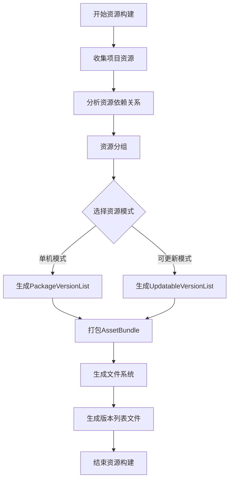
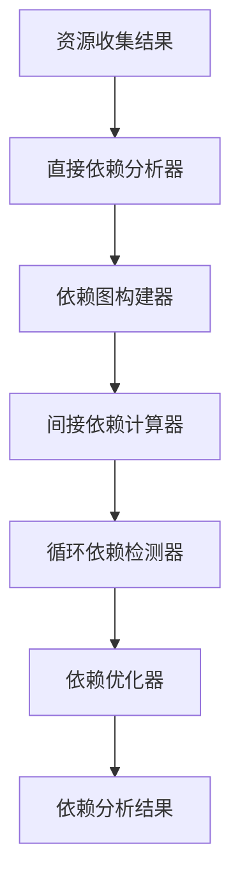
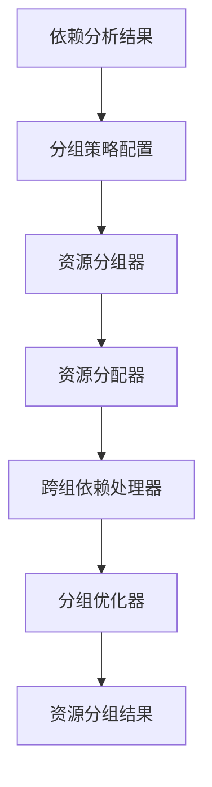
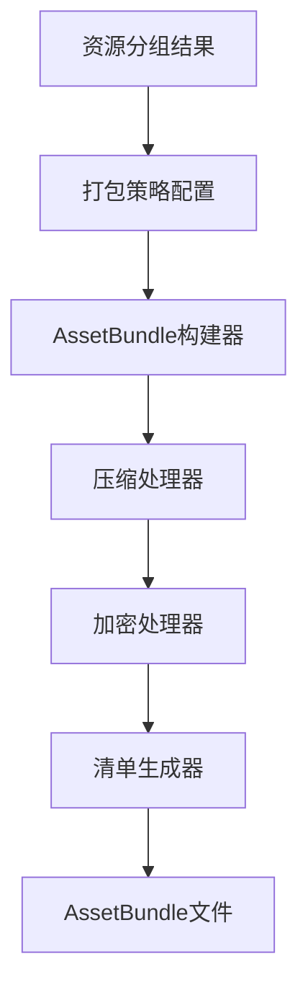
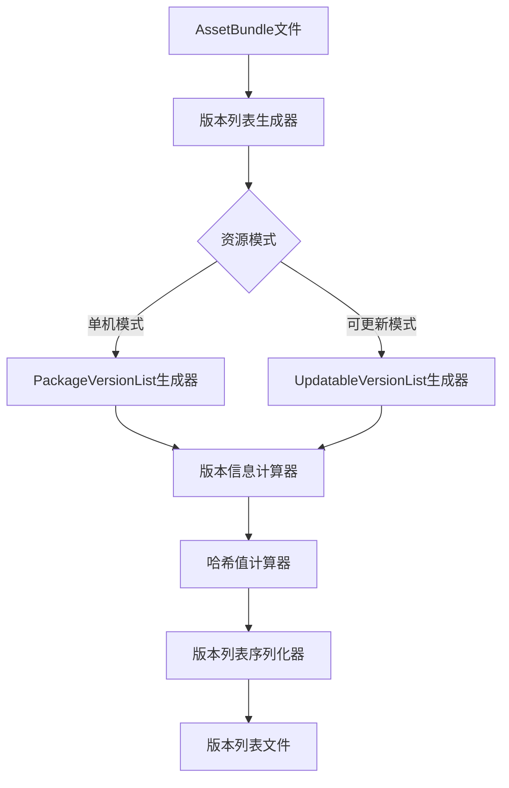
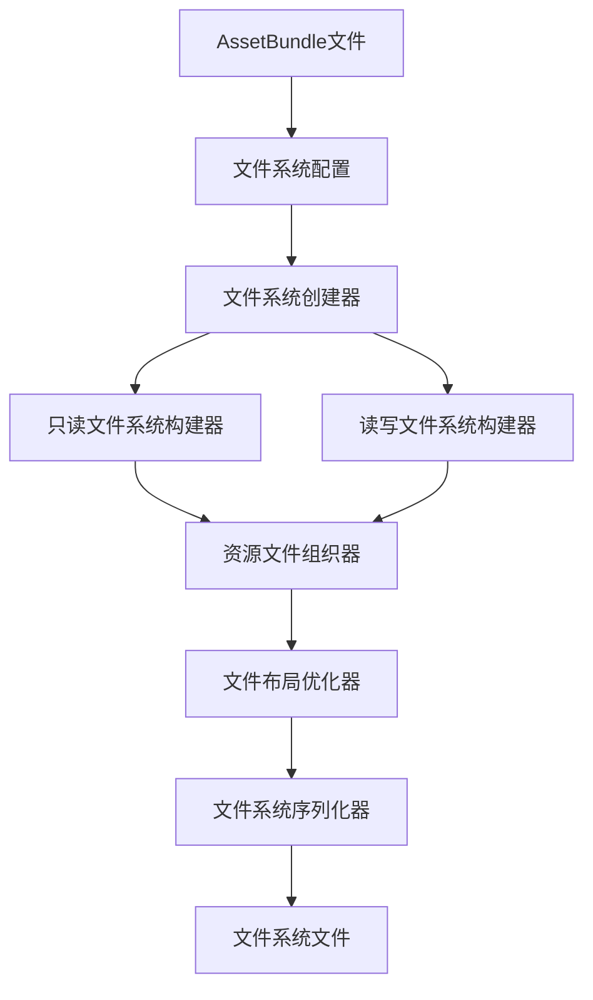
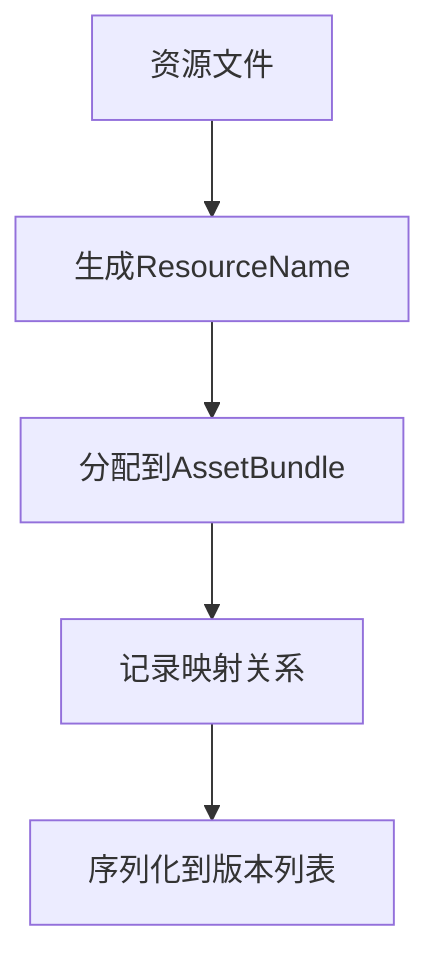

# 资源构建流程详解

## 资源构建概述

资源构建是游戏开发中至关重要的环节，它将项目中的原始资源转换为可在游戏运行时高效加载的格式。GameFramework提供了完整的资源构建流程，支持多种资源模式，满足不同类型游戏的需求。

## 资源构建整体流程

## 资源构建详细步骤

### 1. 资源收集

资源收集是构建流程的第一步，主要任务是扫描项目中的所有资源文件，并根据配置筛选出需要打包的资源。

1. **资源扫描**：
   - 遍历Unity项目的Assets目录
   - 根据配置的包含和排除规则筛选资源
   - 收集资源的基本信息（路径、类型、大小等）

2. **资源标识生成**：
   - 为每个资源生成唯一标识符
   - 处理资源的变体（Variant）信息
   - 生成资源的路径映射表

3. **资源元数据提取**：
   - 提取资源的类型信息
   - 记录资源的导入设置
   - 保存资源的自定义属性

### 2. 依赖分析

依赖分析是构建高效资源系统的关键步骤，它确保资源加载时能正确处理依赖关系。

1. **直接依赖分析**：
   - 使用Unity的AssetDatabase API分析资源直接依赖
   - 记录每个资源引用的其他资源
   - 处理特殊类型资源的依赖（如场景、预制体等）

2. **间接依赖分析**：
   - 基于直接依赖构建完整依赖图
   - 计算资源的所有间接依赖
   - 优化依赖链，避免冗余依赖

3. **循环依赖处理**：
   - 检测并标记循环依赖
   - 采用特殊策略处理循环依赖
   - 生成依赖警告和报告

### 3. 资源分组

资源分组是优化资源管理和更新的重要手段，它将相关资源组织在一起，便于管理和加载。

1. **分组策略**：
   - 按功能模块分组（UI、角色、场景等）
   - 按加载时机分组（预加载、按需加载等）
   - 按更新频率分组（常更新、少更新等）

2. **分组配置**：
   - 设置资源组名称和描述
   - 配置资源组的加载优先级
   - 设置资源组的更新策略

3. **资源分配**：
   - 将资源分配到对应的资源组
   - 处理跨组资源的依赖关系
   - 优化资源组的内部结构

4. **资源组和资源的关系**：
   - 资源组是资源的逻辑集合，不影响资源的物理存储方式
   - 一个资源可以属于多个资源组
   - 资源组在版本列表中通过ResourceGroup表示，包含组名和资源索引
   - 资源组便于批量加载和更新相关资源
   - 资源组可以控制资源加载的优先级和顺序

### 4. 资源打包

资源打包是将处理好的资源转换为可在运行时加载的格式，GameFramework主要使用AssetBundle作为资源包格式。

1. **打包策略**：
   - 配置打包粒度（单个资源、多个资源合并等）
   - 设置压缩方式（LZMA、LZ4等）
   - 配置加密策略（是否加密、加密算法等）

2. **AssetBundle生成**：
   - 为每个资源或资源组创建AssetBundle
   - 设置AssetBundle的名称和变体
   - 调用Unity的BuildPipeline.BuildAssetBundles方法生成AssetBundle

3. **资源清单生成**：
   - 记录AssetBundle中包含的资源
   - 生成资源到AssetBundle的映射表
   - 保存AssetBundle的依赖关系

### 5. 版本列表生成

版本列表是资源系统的核心数据结构，记录了所有资源的版本和状态信息，用于资源更新和加载。

1. **PackageVersionList（单机模式）**：
   - 包含所有资源的信息
   - 不支持资源更新
   - 适用于单机游戏或小型游戏

2. **UpdatableVersionList（可更新模式）**：
   - 包含资源的版本信息
   - 支持资源更新检查
   - 适用于需要热更新的游戏

3. **ResourcePackVersionList（资源包）**：
   - 用于打包多个资源为一个更新包
   - 支持一次性更新多个资源
   - 优化资源更新流程

4. **版本控制信息**：
   - 生成内部资源版本号
   - 记录适配的游戏版本号
   - 计算资源文件的哈希值和长度

### 6. 文件系统生成

文件系统是GameFramework的特色功能，它提供了高效的资源文件组织和访问方式。

1. **文件系统创建**：
   - 创建只读文件系统（ReadOnlyFileSystem）
   - 创建读写文件系统（ReadWriteFileSystem）
   - 配置文件系统参数（最大文件数、块大小等）

2. **资源文件组织**：
   - 将AssetBundle文件组织到文件系统中
   - 设置资源的存储位置和加载方式
   - 优化文件布局，提高读取效率

3. **文件系统序列化**：
   - 序列化文件系统结构
   - 生成文件系统索引
   - 保存文件系统到磁盘

## 资源构建模式比较

GameFramework支持三种资源模式，它们在构建流程上有所不同：

| 特性 | 单机模式 | 可更新模式 | 边玩边更新模式 |
|------|---------|-----------|--------------|
| 版本列表类型 | PackageVersionList | UpdatableVersionList | UpdatableVersionList |
| 资源组织方式 | 统一打包 | 分组打包 | 分组打包+按需下载 |
| 文件系统 | 只读文件系统 | 只读+读写文件系统 | 只读+读写文件系统 |
| 资源更新 | 不支持 | 支持完整更新 | 支持按需更新 |
| 构建复杂度 | 低 | 中 | 高 |

## 资源构建优化策略

为了提高资源构建的效率和质量，GameFramework采用了多种优化策略：

1. **增量构建**：
   - 只处理发生变化的资源
   - 重用未变化资源的构建结果
   - 大幅减少构建时间

2. **并行处理**：
   - 多线程并行处理资源
   - 充分利用多核CPU性能
   - 加速资源分析和打包过程

3. **资源合并**：
   - 合理合并小型资源
   - 减少AssetBundle数量
   - 优化加载性能

4. **冗余消除**：
   - 检测并消除重复资源
   - 优化资源依赖关系
   - 减少最终包体大小

5. **压缩策略**：
   - 根据资源类型选择最佳压缩方式
   - 平衡包体大小和加载速度
   - 支持自定义压缩算法

6. **构建报告**：
   - 生成详细的构建报告
   - 分析资源分布和依赖情况
   - 提供优化建议 
## 资源路径映射构建

在资源构建过程中，资源路径映射的构建是一个关键环节，它决定了运行时如何通过资源名称找到对应的AssetBundle。

### 1. 资源路径映射的生成

在资源构建阶段，系统会为每个资源生成唯一的标识，并记录资源与AssetBundle的对应关系：

### 2. 资源名称到AssetBundle的映射策略

GameFramework支持多种资源到AssetBundle的映射策略：

1. **一对一映射**：每个资源单独打包为一个AssetBundle
   - 优点：精确控制资源加载，减少冗余加载
   - 缺点：AssetBundle数量多，管理复杂

2. **多对一映射**：多个相关资源打包为一个AssetBundle
   - 优点：减少AssetBundle数量，优化加载性能
   - 缺点：可能导致冗余加载

3. **分组映射**：按资源组将资源打包为AssetBundle
   - 优点：便于管理和更新
   - 缺点：需要合理规划资源组

### 3. 资源路径映射的存储结构

资源路径映射信息主要存储在版本列表文件中，包含以下关键数据：

1. **Asset表**：记录每个资源的信息和依赖关系
2. **Resource表**：记录每个AssetBundle的信息
3. **FileSystem表**：记录文件系统信息
4. **ResourceGroup表**：记录资源组信息

这些表之间通过索引建立关联，形成完整的资源映射网络。

### 4. 资源变体的处理

GameFramework支持资源变体机制，在构建时需要特殊处理：

1. **变体标识**：为变体资源添加变体标识
2. **变体映射**：建立变体资源与基础资源的映射关系
3. **变体选择**：运行时根据当前变体设置选择合适的资源

通过这种机制，可以方便地支持多语言、多分辨率等需求。
