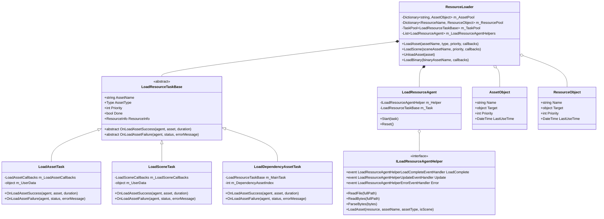

# 资源管理系统类图

## 核心类图

## 资源加载相关类图

## 资源更新相关类图

## 资源版本列表类图

## 文件系统相关类图

## 类图说明

### 核心类

1. **IResourceManager**：资源管理器接口，是整个资源管理系统的核心接口，提供资源加载、更新、校验等功能。

2. **ResourceManager**：资源管理器实现类，实现了IResourceManager接口，负责协调各个组件完成资源管理功能。

3. **ResourceLoader**：资源加载器，负责资源的实际加载工作，管理资源对象池和加载代理。

4. **ResourceUpdater**：资源更新器，负责资源的更新工作，包括下载资源、应用资源包等。

5. **ResourceVerifier**：资源校验器，负责校验资源的完整性和有效性。

6. **ResourceIniter**：资源初始化器，负责初始化资源系统，加载版本列表等。

### 资源加载相关类

1. **LoadResourceTaskBase**：加载资源任务基类，是所有资源加载任务的基础。

2. **LoadAssetTask**：加载普通资源任务，用于加载非场景资源。

3. **LoadSceneTask**：加载场景任务，用于加载场景资源。

4. **LoadDependencyAssetTask**：加载依赖资源任务，用于加载资源的依赖。

5. **LoadResourceAgent**：资源加载代理，负责实际的资源加载操作。

6. **AssetObject**：资源对象，表示已加载的资源。

7. **ResourceObject**：资源包对象，表示已加载的资源包。

### 资源更新相关类

1. **ResourceChecker**：资源检查器，负责检查哪些资源需要更新。

2. **UpdateInfo**：更新信息，包含需要更新的资源信息。

3. **ApplyInfo**：应用信息，包含需要应用的资源包信息。

4. **CheckInfo**：检查信息，包含资源的本地和远程版本信息。

### 资源版本列表类

1. **PackageVersionList**：单机模式版本资源列表，包含所有资源信息。

2. **UpdatableVersionList**：可更新模式版本资源列表，包含资源版本信息。

3. **ResourcePackVersionList**：资源包版本列表，用于打包多个资源为一个资源包。

### 文件系统相关类

1. **IFileSystemManager**：文件系统管理器接口，负责创建和管理文件系统。

2. **IFileSystem**：文件系统接口，提供文件的读写功能。

3. **FileSystemAccess**：文件系统访问方式枚举，包括只读和读写两种模式。

4. **LoadType**：资源加载类型枚举，包括从文件加载和从内存加载等方式。

