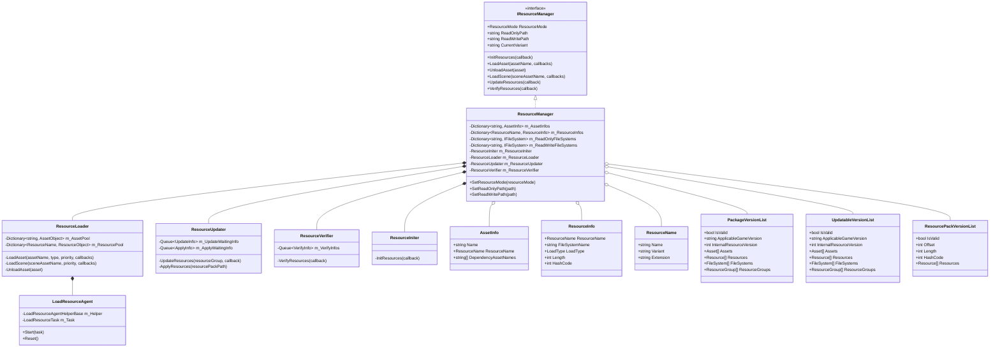
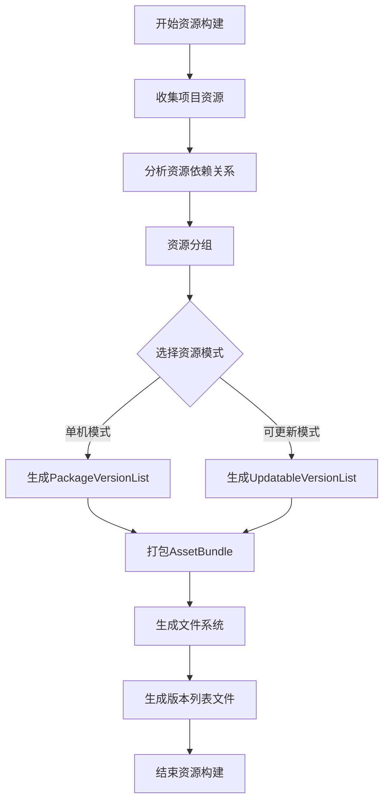
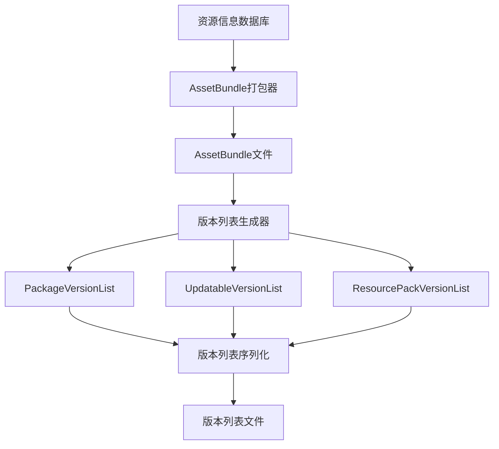
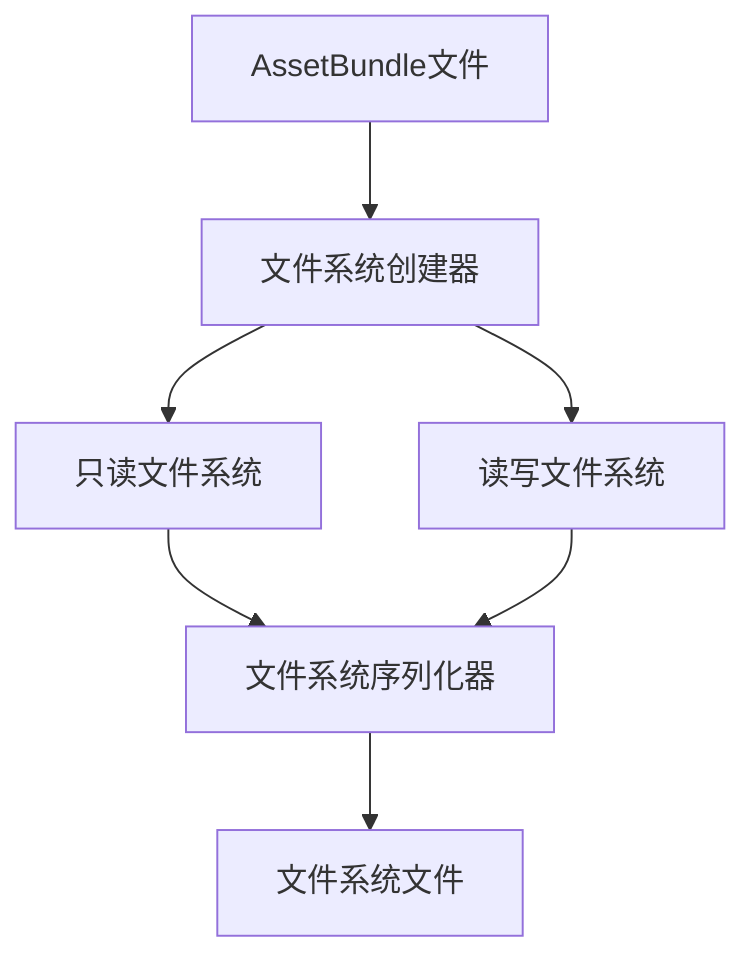
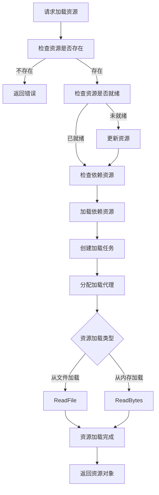

# 资源管理系统详细设计文档

## 目录
1. [系统概述](#系统概述)
2. [类图设计](#类图设计)
3. [资源构建流程](#资源构建流程)
   - [资源构建整体流程](#资源构建整体流程)
   - [资源收集与分析](#资源收集与分析)
   - [资源打包与版本控制](#资源打包与版本控制)
   - [文件系统生成](#文件系统生成)
4. [资源加载流程](#资源加载流程)
5. [时序图](#时序图)
6. [关键类与接口说明](#关键类与接口说明)

## 系统概述

GameFramework资源管理系统提供了一套完整的资源管理解决方案，从资源打包、版本控制、资源更新到资源加载的全流程都有详细的实现。它支持三种资源模式：单机模式、可更新模式和边玩边更新模式，满足不同的游戏需求。

## 类图设计



## 资源构建流程

### 资源构建整体流程



### 资源收集与分析

资源收集与分析是资源构建的第一步，主要包括以下几个环节：

1. **资源收集**：
   - 遍历项目中的所有资源文件
   - 根据配置筛选需要打包的资源
   - 为每个资源生成唯一标识符

2. **依赖分析**：
   - 分析每个资源的直接依赖和间接依赖
   - 构建资源依赖图
   - 优化依赖关系，避免循环依赖

3. **资源分组**：
   - 根据功能模块将资源分组
   - 设置资源组的优先级和更新策略
   - 处理资源组之间的依赖关系


### 资源打包与版本控制

资源打包与版本控制是资源构建的核心环节，主要包括以下几个步骤：

1. **资源打包**：
   - 根据资源信息数据库，将资源打包成AssetBundle
   - 设置AssetBundle的压缩方式和加密策略
   - 生成AssetBundle的清单文件

2. **版本列表生成**：
   - 生成PackageVersionList（单机模式）
     - 包含所有资源信息，用于本地加载
     - 不支持热更新
   - 生成UpdatableVersionList（可更新模式）
     - 包含资源版本信息，用于检查更新
     - 支持热更新
   - 生成ResourcePackVersionList（资源包）
     - 用于打包多个资源为一个资源包
     - 支持一次性更新多个资源

3. **版本控制**：
   - 生成内部资源版本号（InternalResourceVersion）
   - 记录适配的游戏版本号（ApplicableGameVersion）
   - 计算资源文件的哈希值，用于校验资源完整性



### 文件系统生成

文件系统生成是资源构建的最后环节，主要包括以下几个步骤：

1. **文件系统创建**：
   - 创建只读文件系统（ReadOnlyFileSystem）
   - 创建读写文件系统（ReadWriteFileSystem）
   - 设置文件系统的最大文件数和最大块数

2. **资源文件组织**：
   - 将AssetBundle文件组织到文件系统中
   - 设置资源的存储位置和加载方式
   - 优化资源的读取效率

3. **文件系统序列化**：
   - 序列化文件系统结构
   - 生成文件系统索引
   - 保存文件系统到磁盘



## 资源加载流程



## 时序图

### 资源初始化时序图

```mermaid
sequenceDiagram
    参与者 Client
    参与者 ResourceManager
    参与者 ResourceIniter
    参与者 VersionListProcessor
    
    Client->>ResourceManager: InitResources(callback)
    ResourceManager->>ResourceIniter: InitResources(callback)
    ResourceIniter->>VersionListProcessor: ProcessVersionList()
    VersionListProcessor-->>ResourceIniter: 版本列表处理完成
    ResourceIniter->>ResourceIniter: 加载资源信息
    ResourceIniter-->>ResourceManager: 初始化完成
    ResourceManager-->>Client: 回调初始化结果
```

### 资源更新时序图

```mermaid
sequenceDiagram
    参与者 Client
    参与者 ResourceManager
    参与者 ResourceChecker
    参与者 ResourceUpdater
    
    Client->>ResourceManager: CheckResources(callback)
    ResourceManager->>ResourceChecker: CheckResources()
    ResourceChecker-->>ResourceManager: 检查结果(需更新资源列表)
    ResourceManager-->>Client: 回调检查结果
    
    Client->>ResourceManager: UpdateResources(callback)
    ResourceManager->>ResourceUpdater: UpdateResources()
    ResourceUpdater->>ResourceUpdater: 下载资源
    ResourceUpdater-->>ResourceManager: 更新完成
    ResourceManager-->>Client: 回调更新结果
```

### 资源加载时序图

```mermaid
sequenceDiagram
    参与者 Client
    参与者 ResourceManager
    参与者 ResourceLoader
    参与者 LoadResourceAgent
    
    Client->>ResourceManager: LoadAsset(assetName, callbacks)
    ResourceManager->>ResourceLoader: LoadAsset(assetName, type, priority, callbacks)
    ResourceLoader->>ResourceLoader: 检查资源是否存在
    ResourceLoader->>ResourceLoader: 加载依赖资源
    ResourceLoader->>LoadResourceAgent: 分配加载代理
    LoadResourceAgent->>LoadResourceAgent: 加载资源
    LoadResourceAgent-->>ResourceLoader: 资源加载完成
    ResourceLoader-->>ResourceManager: 返回资源对象
    ResourceManager-->>Client: 回调加载结果
```

## 关键类与接口说明

### IResourceManager

资源管理器接口，是整个资源管理系统的核心接口，提供资源加载、更新、校验等功能。

### ResourceManager

资源管理器实现类，实现了IResourceManager接口，负责协调各个组件完成资源管理功能。

### ResourceLoader

资源加载器，负责资源的实际加载工作，管理资源对象池和加载代理。

### ResourceUpdater

资源更新器，负责资源的更新工作，包括下载资源、应用资源包等。

### ResourceVerifier

资源校验器，负责校验资源的完整性和有效性。

### ResourceIniter

资源初始化器，负责初始化资源系统，加载版本列表等。

### LoadResourceAgent

资源加载代理，负责实际的资源加载操作，支持从文件加载和从内存加载两种方式。

### AssetInfo

资源信息，包含资源名称、所属资源包、依赖资源等信息。

### ResourceInfo

资源包信息，包含资源包名称、文件系统名称、加载类型、长度、哈希值等信息。

### ResourceName

资源名称，包含名称、变体、扩展名等信息。

### PackageVersionList

单机模式版本资源列表，包含所有资源信息，用于本地加载，不支持热更新。

### UpdatableVersionList

可更新模式版本资源列表，包含资源版本信息，用于检查更新，支持热更新。

### ResourcePackVersionList

资源包版本列表，用于打包多个资源为一个资源包，支持一次性更新多个资源。 